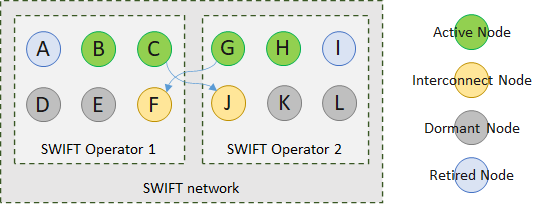
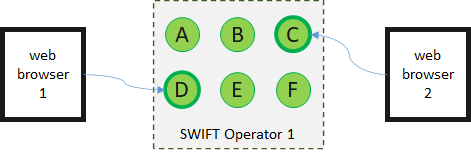

# Shared Web InFormaTion (SWIFT)

## Abstract

Some common web use cases require information to be shared among multiple first
parties. Historically these use cases were supported via so-called third-party
cookies (3PC). An alternative is required because some user agent vendors
(browsers) are phasing out support for this long-standing feature of the web.

This project is solely concerned with the secure and privacy preserving sharing
of information across multiple domains and does not consider information that is
outside implementor’s networks. For example; when data leaves the network or
prior to it being stored in the network.

## Use Cases

Common use cases that require information to be shared across multiple domains
include.

-   Authentication use cases
    -   Network access, such as public WiFi hotspot authentication.
    -   Content access, such as secure access to personal information stored in
        websites, such as email or social network accounts.
    -   Service or product procurement, such as secure payment via the web.
-   Pseudonymous use cases
    -   Personalization, such as improving the effectiveness of content matching
        on multiple publishers that requires feedback to inform the correlation
        statistics of exposure to subsequent activity.
    -   Ex-ante improvements to advertising effectiveness, such as controlling
        the number of times someone sees the same advert across multiple
        publishers (frequency capping).
    -   Intra-campaign or post campaign improvements to advertising
        effectiveness, determining the value of advertising campaign exposure on
        multiple publisher properties given the subsequent effectiveness of
        driving awareness, engagement or revenue for a marketer.
    -   Intra-campaign or post campaign auditing of advertising effectiveness,
        such as counting the total advertising campaign exposures across
        multiple publishers (used for billing) or detecting publishers who
        attempt to overcharge marketers for the serving of their advertising
        campaigns (fraud detection).

These use cases create a frictionless experience when accessing cross-publisher
web services and facilitate a competitive open web when compared to solutions
that centralize all data within only a few organizations.

A shared unique identifier for a user agent, or in some cases a person’s
account, is required to support the above use cases. This specification provides
a method for such identifiers to be shared between internet domains in a manner
that is both privacy preserving, implemented using only the most generic and
universally deployed HTTP and web features, and supports the [W3C One Web
mission](https://www.w3.org/Consortium/mission.html) by accommodating all major
current user agent implementations. As such this recommendation focuses on the
needs of people, [the primary constituents of the
web](https://www.w3.org/TR/html-design-principles/#priority-of-constituencies),
followed by content authors also known as “publishers”.

## Design Considerations

Design considerations in order of importance are:

1.  Ensure people are in control of their privacy to aid compliance with privacy
    regulations such as GDPR and CCPA.
2.  Only persist information in the user agent using the most common and
    established IETF standards recommendations. No information should ever be
    persisted server side.
3.  Create a solution that embraces the W3C One Web mission by supporting all
    common browser defaults.
4.  Support a decentralized web by enabling a network of multiple operators.
5.  Present the most pleasing user experience possible given the prior
    considerations.
6.  Provide opportunities to signal the user to change browser settings to
    support the implementation.

## Standards

Whilst the solution does not require any new features to be implemented within
user agents, it is important it progresses through the W3C to become a technical
recommendation to minimize the possibility of future W3C WICG proposals, W3C
candidate recommendations, or IETF specifications altering the features on which
the solution relies without due consideration.

This recommendation is dependent on the following IETF standard.

-   Cookies [[RFC6265](https://tools.ietf.org/html/rfc6265)]
-   HTTP temporary redirect
    [[RFC7231](https://tools.ietf.org/html/rfc7231#section-6.4.7)]
-   HTTP URL [[RFC3986](https://tools.ietf.org/html/rfc3986)]

The recommendation is also dependent on
[HTML](https://html.spec.whatwg.org/#attr-meta-http-equiv-refresh) and the meta
element’s refresh attributes currently governed by WHATWG.

## Out of Scope

### Compliance

Complying with GDPR or any other regional law is a matter for web authors, data
controllers or data processors and the advice of their privacy counsel.

### Authentication

Implementors of networks are free to determine the authentication method they
wish to use that is suitable for the purpose and nature of the information they
intend to store. A single organization implementing a network for the purposes
of sharing information across multiple domains they own will be the only
organization accessing the network. Multiple organizations using a network may
require the administrator to provide unique access tokens that enable an audit
log of access requests to be maintained.

## Normative References

| **Term** | **Reference**                                                                  |
|----------|--------------------------------------------------------------------------------|
| Domain   | [RFC 920 - Domain requirements (ietf.org)](https://tools.ietf.org/html/rfc920) |

## Definitions

The following definitions are used throughout this project.

| **Term**                 | **Description**                                                                                                                                                                                                                                                                                                                |
|--------------------------|--------------------------------------------------------------------------------------------------------------------------------------------------------------------------------------------------------------------------------------------------------------------------------------------------------------------------------|
| Access Node              | A node of the network that is used to initiate requests to the network from a server. Never accessed directly by the web browser. The access node is responsible for authentication to ensure only authorised entities can access the network.                                                                                 |
| Conflict Policy          | Where multiple data values exist for the same key the policy determines if the most recent, or the oldest value is used, or if the key represents a list values signals that a unique union should be the result of a conflict.                                                                                                |
| Expiry                   | Key value must be set to expire at a given time. This feature can be used to ensure that values are deleted automatically across the network at a given point in time.                                                                                                                                                         |
| Home Node                | A node that for a short period of time is most closely associated with a web browser. Used to reduce the chances of more than one node needing to used for a storage operation intended to retrieve data from the network.                                                                                                     |
| Key                      | The key associated with the data in the network. The key name appears as the cookie name associated with the table or URL path. Unlike traditional key names keys must also include an expiry time for the value and a conflict resolution policy.                                                                             |
| Network                  | Multiple nodes communicating with each other via the user agent’s address bar and a sequence of HTTP GET requests.                                                                                                                                                                                                             |
| Node                     | An internet domain which implements this recommendation. A node must be run by an Operator and conform to the requirements of the SWIFT Network.                                                                                                                                                                               |
| Operator                 | An entity provisioning one or more nodes in the network.                                                                                                                                                                                                                                                                       |
| Scramble                 | Table names and keys are scrambled by each node to ensure that they are unique to the node.                                                                                                                                                                                                                                    |
| Secrets                  | Secrets are used to encrypt all data.                                                                                                                                                                                                                                                                                          |
| Storage Node             | A node that is used to write and read information and accessed via the web browser.                                                                                                                                                                                                                                            |
| Storage Operation        | The action of accessing the network to simultaneously write and read information. Values for keys must always be provided so that information is returned when no value exists already in the network. There is no concept of a pure write or a pure read operation.                                                           |
| Storage Operation Expiry | Each encryption operation associated with the storage operation will include a timestamp after which the operations data will be considered unusable other than the return URL. This will typically be no more than a few seconds where the clock used to generate the expiry time and validate the timestamp is synchronised. |
| Table                    | Analogous to a relational database’s definition of table. The table name appears as the first segment in the URL path.                                                                                                                                                                                                         |

## Concept

A network of distributed domains known as “nodes” are used to securely store
information within first party cookie files associated with multiple nodes. The
network consists of multiple nodes and operators adhering to the SWIFT standard
of interoperability.

The following diagram provides an overview of the concept covering initiation (1
&2), storage (3 to 5) and completion (6 &7).

1.  Website passes information to a Host’s access node to encrypt and return
    with first node URL.
2.  Website directs the web browser to the URL returned from step 1 and
    processes the cookies provided setting new ones if necessary.
3.  Node A directs the web browser to node D settings and reading cookies.
4.  Node D directs the web browser to node F setting and read cookies.
5.  Node F directs the web browsers back to node A to set and read cookies. It
    is possible other nodes contained more recent data than node A at step 2 and
    this updated data should be recorded in node A before returning to the
    website operator’s return URL.
6.  Node A directs the web browser to the website operators return URL with the
    encrypted data inserted into the return URL.
7.  Website operator extracts the encrypted information from the URL and passes
    it to the Host’s access node to decrypt.

When viewed from the perspective of the web browser steps 1 and 7 would not be
visible. The others would involve one-time encrypted data and might appear in
the following order when observed by the web browser.

| **Step** | **Domain**  | **Path**                                                       | **Cookies**                                |
|----------|-------------|----------------------------------------------------------------|--------------------------------------------|
| 2        | Node-A.com  | Encrypted storage operation data unique to the domain and path | Encrypted domain and path specific cookies |
| 3        | Node-D.com  |                                                                |                                            |
| 4        | Node-F.com  |                                                                |                                            |
| 5        | Node-A.com  |                                                                |                                            |
| 6        | Website.com |                                                                |                                            |

The domain names assigned to the letters A to F are not important and show
purely for illustrative purposes.

The operation of SWIFT can be observed in the web browser in the demos available
at <https://swan-demo.uk>.

### Initiation

Data is written to the network by passing a return URL, table name, and one or
more key/value pairs, in a server-to-server call to build a URL that the user
agent should navigate to so that the current information can be retrieved or
updated.

Keys must also contain a greater than (\>) or a less than sign (\<) to indicate
the conflict policy to use for the operation. A less than sign indicates that
the oldest value in the network should be used if a value exists. A greater than
sign indicates that the newest value, probably the value provided, is used if a
value already exists.

A plus sign (+) can also be used to combine multiple values into a list.

The following is an example of a URL passed from a server to an access node. The
URL to return the browser window to is https://example.com, the table name is
“example”, the key is “key” where the value will expire on 1st January 2021 and
will overwrite any existing values.

~~~~~~~~~~~~~~~~~~~~~~~~~~~~~~~~~~~~~~~~~~~~~~~~~~~~~~~~~~~~~~~~~~~~~~~~~~~~~~~~
https://accessnode.net/api/v1/create?returnUrl=https://example.com&table=example&key>2021-01-01=hello
~~~~~~~~~~~~~~~~~~~~~~~~~~~~~~~~~~~~~~~~~~~~~~~~~~~~~~~~~~~~~~~~~~~~~~~~~~~~~~~~

The access node will then respond with a URL that is not human readable for the
first storage node to use for the storage operation. The path is encrypted by
the access node with a secret it obtained from the first storage node to be used
for the operation.

~~~~~~~~~~~~~~~~~~~~~~~~~~~~~~~~~~~~~~~~~~~~~~~~~~~~~~~~~~~~~~~~~~~~~~~~~~~~~~~~
https://storagenode-a.net/OC41MWRjLnVrOC412Mv6Vp0DFeTCFhhKHz1H2JabpJ8cA-4/mKsa58t6yxpX...DnAUvPo2GdyJBLXM
~~~~~~~~~~~~~~~~~~~~~~~~~~~~~~~~~~~~~~~~~~~~~~~~~~~~~~~~~~~~~~~~~~~~~~~~~~~~~~~~

The web server initiating the request will be responsible for redirecting the
web browser window to the returned URL. This could be achieved for an HTTP 303
redirect, via JavaScript changing the navigation URL, or via any other method.

### Storage operations

Each storage node will perform the following actions.

1.  Receive the HTTP request and decrypt the URL path to obtain details of the
    storage operation.
2.  Evaluate the cookies the storage node domain and path already possess from a
    previous operation if any, and either replacing them with the values held in
    the storage operation or updating the storage operation with the values from
    the cookies it possess.
3.  Create the next URL to visit.

    a. If the number of nodes required to complete the storage operation have
    not yet been visited then choose another storage node at random and encrypt
    the operation data so that the next node can decrypt it.

    b. If all the required nodes have been visited then use the return URL as
    the next URL to direct to. The operation data will be encrypted so that the
    access node used at initiation can decrypt it.

4.  Respond to the browser with HTML and a meta refresh element to redirect the
    browser user interface to.
5.  If an exception occurs, for example cookies are disabled, there is a limit
    on the number of redirects the user agent allows, or there is a limit on URL
    lengths that prevent the storage operation being decrypted, then a message
    can be presented to the user asking them to alter their browser settings
    before retrying.

The HTML response is important to inform the user as to what is happening and
display a progress indicator and any additional information. The reference
implementation uses a consistent progress circle and a simple message to
communicate status to the user.

### Completion

When the web browser window returns to the return URL the encrypted data will be
appended to the URL. The web site operator must then extract the encrypted data
and pass it to the Operators’ Access Node to be decrypted via a server-to-server
request. The following URL shows an example.

~~~~~~~~~~~~~~~~~~~~~~~~~~~~~~~~~~~~~~~~~~~~~~~~~~~~~~~~~~~~~~~~~~~~~~~~~~~~~~~~
http://51dc.uk/api/v1/decrypt?c9hGPPnJxRNckc...Q58765kHzbIRN
~~~~~~~~~~~~~~~~~~~~~~~~~~~~~~~~~~~~~~~~~~~~~~~~~~~~~~~~~~~~~~~~~~~~~~~~~~~~~~~~

The access node will return the keys in a JSON format with the created and
expiry times added. The following is an example when the key and value are shown
earlier are returned.

~~~~~~~~~~~~~~~~~~~~~~~~~~~~~~~~~~~~~~~~~~~~~~~~~~~~~~~~~~~~~~~~~~~~~~~~~~~~~~~~
[{
"Key":"key",
"Created":"2020-09-30T00:00:00Z",
"Expires":"2020-11-21T00:00:00Z",
"Value":"hello"
}]
~~~~~~~~~~~~~~~~~~~~~~~~~~~~~~~~~~~~~~~~~~~~~~~~~~~~~~~~~~~~~~~~~~~~~~~~~~~~~~~~

## Example server-side pseudo code

The following provides a server-side example of the code needed to implement the
solution for various scenarios.

### Create a service provider

~~~~~~~~~~~~~~~~~~~~~~~~~~~~~~~~~~~~~~~~~~~~~~~~~~~~~~~~~~~~~~~~~~~~~~~~~~~~~~~~
// Create a singleton to access the network.
var swift = new SwiftService([Access Node], [Access Credentials]);
~~~~~~~~~~~~~~~~~~~~~~~~~~~~~~~~~~~~~~~~~~~~~~~~~~~~~~~~~~~~~~~~~~~~~~~~~~~~~~~~

### Create the URL

~~~~~~~~~~~~~~~~~~~~~~~~~~~~~~~~~~~~~~~~~~~~~~~~~~~~~~~~~~~~~~~~~~~~~~~~~~~~~~~~
// Example 1. Fetch the value that exists only setting it to value if a value
does not already exist.
var url = swift.CreateStorageUrl(
    [returnUrl],
    [table],
    new Pair([key], [value], [conflictPolicy.OldestWins], [expiry-date]);

// Example 2. Set the value if there isn’t another one that is newer.
var url = swift.CreateStorageUrl(
    [returnUrl],
    [table],
    new Pair([key], [value], [conflictPolicy.NewestWins], [expiry-date]);

// Example 3. As example 1 with a custom user interface color scheme, message and title.
var url = sharedStateService.CreateStorageUrl(
    [returnUrl],
    [table],
    new Pair([key], [value], [conflictPolicy.OldestWins], [expiry-date],
    [title],
    [message],
    [backgroundColor],
    [messageColor],
    [progressColor]);
~~~~~~~~~~~~~~~~~~~~~~~~~~~~~~~~~~~~~~~~~~~~~~~~~~~~~~~~~~~~~~~~~~~~~~~~~~~~~~~~

### Start redirection

~~~~~~~~~~~~~~~~~~~~~~~~~~~~~~~~~~~~~~~~~~~~~~~~~~~~~~~~~~~~~~~~~~~~~~~~~~~~~~~~
// Use the location header to get the response to the current web request to
redirect the browser to a new page.
response.Headers.Add(“Location”, url);
response.Status = 304;
~~~~~~~~~~~~~~~~~~~~~~~~~~~~~~~~~~~~~~~~~~~~~~~~~~~~~~~~~~~~~~~~~~~~~~~~~~~~~~~~

### Receive the information from the complete operation

~~~~~~~~~~~~~~~~~~~~~~~~~~~~~~~~~~~~~~~~~~~~~~~~~~~~~~~~~~~~~~~~~~~~~~~~~~~~~~~~
// The path from the request URL is passed to the service to return the value.
var jsonValues = swift.GetStorageValue([request.url.path]);
~~~~~~~~~~~~~~~~~~~~~~~~~~~~~~~~~~~~~~~~~~~~~~~~~~~~~~~~~~~~~~~~~~~~~~~~~~~~~~~~

## User interface

As this project is deployed widely people will become used to the short delay
that occurs prior to the publisher’s content becoming visible or when they
provide information to store in SWIFT networks. The intention of the user
interface components is to provide a very simple and familiar user interface
with limited customization to suit website operators’ requirements. For example,
the colors can be chosen to match the primary colors used by the publisher to
avoid a jarring experience, or the title and message could reflect the
publisher’s brand. Storage operation messages might include “Hang tight. We’re
getting things ready” for a consumer brand, or “Fetching shared information” for
a more engineering audience. In all cases the message should take roughly the
same length of time to read as the storage operation takes to complete.

As modern browsers avoid a jarring experience when navigating between pages by
keeping the previous page visible until the new one is ready to be rendered the
effect in practice of navigating between pages which display the same simple
content is pleasingly smoothly. This is an important principle when considering
people’s use of the web.

## Network

By duplicating the same data in first party cookies associated with multiple
domains in the same web browser a network is formed. If a single domain is
retired from the network the data will persist in first party cookies stored in
the other domains. A Node is associated with a single internet domain and also
includes the server side compute resource needed for the Node to function.

The following diagram shows a network with two Operators (1 and 2) each
operating six Nodes.

The following definitions apply to each of the four node types.

-   Active node – a Storage Node that is currently available to support storage
    operations and is known only to its Operator.
-   Interconnect node - an active storage node which is also known to one or
    more other Operators. These nodes can be used by the other Operators to pass
    Storage Operations to.
-   Dormant node - a node that is ready to become part of the network but is not
    yet known to other nodes.
-   Retired node – a node that is no longer available for new Storage
    Operations.

In the diagram nodes B, C, F, G, H and J are active nodes that can be used for
storage operations. Nodes F and J are also known to Operators 2 and 1
respectively and therefore can be used to pass storage operations between
Operators in the same network.

Nodes A and I have been retired from the network and are no longer being used.

Nodes D, E, K and L are ready to join the network when the Operators marks them
active.

## Home node

Networks may contain 100s of nodes run by many Operators. It is important to
minimise delay when performing a storage operation, particularly the more
repetitive read operations commonly used with web browser state data.

A Home Node is identified using some data that will be consistent for a period
of time for a given web browser. The public IP address used for HTTP requests by
the web browser is suitable for this purpose.

In the following diagram node D is the Home Node for web browser 1, and node C
the Home Node for web browser 2.

The Home Node is used as the first and last storage node for the storage
operation. Where information is being retrieved from the network if the Home
Node holds a recent copy of the information other nodes in the network will not
need to be consulted and a single node is required to complete the operation.

Home Nodes provide the benefits of a single fixed domain used for the sharing of
web information without requiring a single centralized operator. They will also
vary over time as the IP address or network changes.

## Conflicts

Because the network may contain more nodes than can practically be accessed in a
single storage operation it is possible that multiple values for the same key
will exist in the network.

Consider two storage operations where each operation contains different values
for the same key. Which one is the intended value for the key?

Consider the first time the data is stored in nodes A to M. The second time the
data is stored in nodes N to Z. There will be two different data values for the
same key within the network.

To resolve this problem time is a critical feature of the network. The UTC time
that the data was added to the network will be recorded with the data. UTC time
is always calculated by the server operating the Node and as such should be
consistent across the network. The Browser time is never used.

When a storage operation is carried out the requestor can decide how they wish a
conflict between multiple data values for the same key to be resolved. They can
request that the oldest value is returned, the newest value, or if the key
relates to a list of values that a unique list is formed.

By favoring the oldest value that value is more likely to become the probable
value returned the more often a large network is accessed.

In practice this scenario will occur infrequently due to the assignment of a
Home Node and ensuring the Home Node is used for the first and last storage
operation.

## Keys

Any requestor of the network is free to specify the table and keys used for the
storage operation. This enables multiple requestors to use the network and share
state data using the same table and key names where they have agreed on naming
conventions.

## Data structures

### Key value

The value data stored is wrapped in the following structure. The data structure
is used when storing data as a cookie, and alongside other fields when
transmitted as part of a storage operation.

| **Field Name** | **Data Type**   | **Description**                                                                               |
|----------------|-----------------|-----------------------------------------------------------------------------------------------|
| Key            | String          | The name of the key associated with the value.                                                |
| Created        | Long (8 bytes)  | A time in UTC conforming indicating when the value was created. Used for conflict resolution. |
| Expires        | Short (2 bytes) | Number of hours after created date that the value will expire.                                |
| Value          | String          | The information stored as a string.                                                           |

### Storage Operation URLs

The table associated with the storage operation is the first segment of the URL
path. The table is not stored in the data structure to avoid duplication.

A storage operation URL consists of the following.

<https://[domain> associated with the node]/[encrypted table name]/[encrypted
storage operation]

The encrypted storage operation includes the following data.

| **Field Name**   | **Data Type**  | **Description**                                                                                              |
|------------------|----------------|--------------------------------------------------------------------------------------------------------------|
| Timestamp        | Long (8 bytes) | The time in UTC that the operation was created. Used to identify expired operations to avoid replaying them. |
| ReturnURL        | String         | The URL to return to with the encrypted operation data applied to the end.                                   |
| AccessNode       | String         | The access node used to create the operation.                                                                |
| Title            | String         | The title to display in the user agent whilst the storage operation is executed.                             |
| Message          | String         | The message to display in the user agent window whilst the storage operation is executed.                    |
| Background Color | String         | The CSS background color to use in the user agent window.                                                    |
| Message Color    | String         | The CSS color code to use for the message.                                                                   |
| Progress Color   | String         | The CSS color code to use for the user interface component that indicates progress of the storage operation. |
| NodesVisited     | Byte           | The number of storage nodes visited so far.                                                                  |
| NodeCount        | Bytes          | The number of nodes that should be visited by the storage operation.                                         |
| HomeNode         | String         | The home node that must be visited as the last storage operation.                                            |
| Key/Values       | Array          | An array of the key value pairs currently being used for the storage operation.                              |

An example of the complete storage operation follows.

~~~~~~~~~~~~~~~~~~~~~~~~~~~~~~~~~~~~~~~~~~~~~~~~~~~~~~~~~~~~~~~~~~~~~~~~~~~~~~~~
https://19.51da.uk/MTkuNTFkYS51azE5BisFF7tTIVTmcQfiNMEcLdQ2m0U/3O5gSA-mxGX8Wg71vF4W6m2Seyj3wQpGfPlc3giL86ddSnlxABLV7TYppuWiNqE0zIFztlAEL3Lfe1xZdyljifW1xRF8mKujBFr2yn_UIQB-MYsec354Ae1d1cEx4nw4HTRiFuTeJKCGjfG8U2HK3FzL5Sldwcd_RbQw5RD3-kSBZEteIEi0nyIHATQVTYbXEMBwrLV3RJptqWG0MpmdRnqg88OTdk1yVrnkzdRnXOPvLs7J9zFALabIWCQkEZuPdAC-NOW2mvW0it7oZ8Ya4Ni5ABek1EDZqz3A8V1yMu6xXkWkJfH86Yy_6xij4oaWIjsYhC1W4k-f3VK4wmp7oSzqMhhE-3XgmKTLaVeCog
~~~~~~~~~~~~~~~~~~~~~~~~~~~~~~~~~~~~~~~~~~~~~~~~~~~~~~~~~~~~~~~~~~~~~~~~~~~~~~~~

## Other considerations

### Multiple Networks

Multiple independent networks can exist with different implementation policies.
For example, a network used for the distribution of pseudonymous identifiers for
the purposes of advertising among entities that have implemented the necessary
contractual agreements to trust each other with shared data might have specific
requirements around the encryption and distribution of values before they are
stored. This recommendation supports such a requirement but does not prescribe
the non-technical features that network participants may wish to adhere to.

### Consent fatigue

A primary use cases associated with the need for shared web information is
storing privacy consent preferences across multiple parties. People will be able
to express their consent preferences once without needing to surrender directly
identifiable personal data and have this information shared across multiple
organizations. As such it is expected that shared web information will
contribute a net improvement in web performance as perceived by people in
practice.

### Unauthorized Access

Each Operator should implement authentication mechanisms at Access Nodes.
Operators forming a network must agree a common standard and level of
authentication sufficient to prevent unauthorized access.

As the information only ever persists in encrypted web browser cookies
associated with a Nodes in the SWIFT network the risks of unauthorized access
via the web browser no different to any other web site or service. As the data
can not be shared across different domains in the web browser control over
access to the data is maintained by the Operators.
